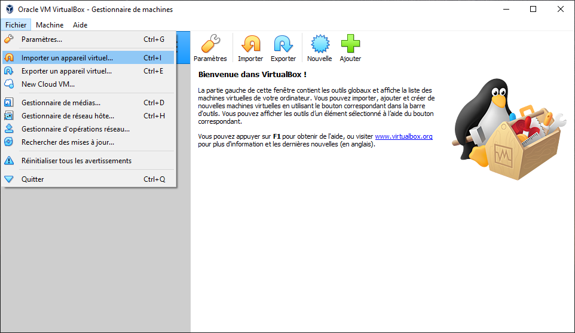
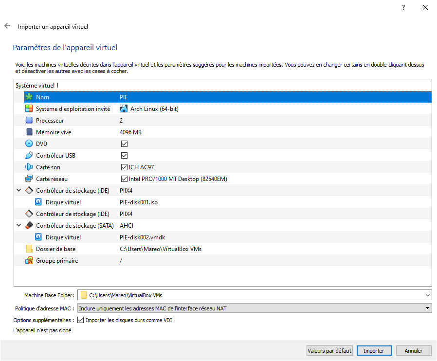
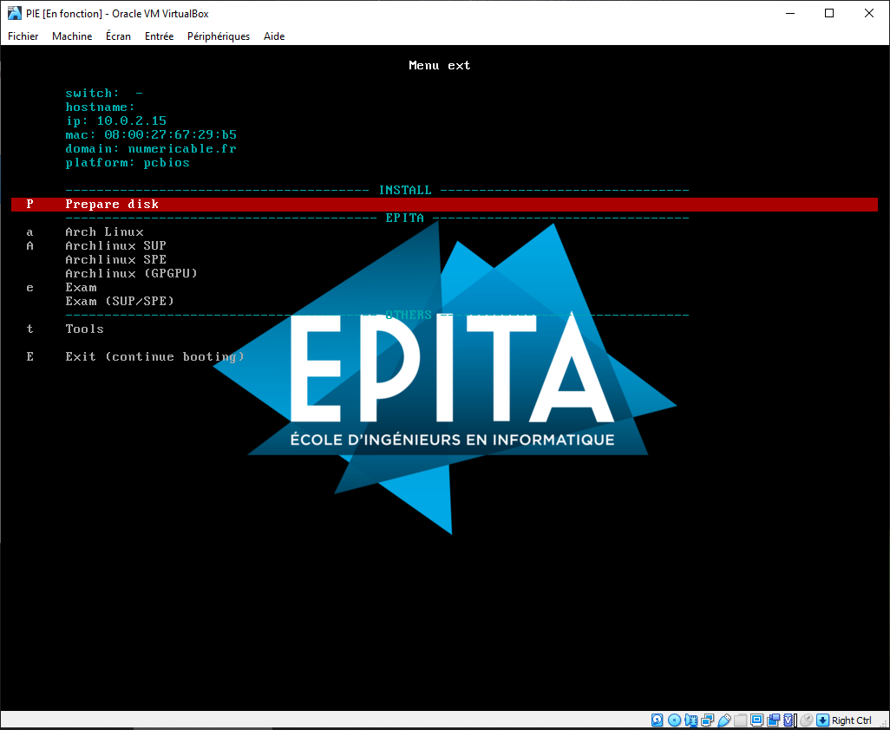

# How to setup and use the PIE VM

This method allow you to have the PIE environment running in a VM on your
computer.

## First step

Install [Virtual Box](https://www.virtualbox.org/).

On linux you can install it with your package manager ([Debian](https://wiki.debian.org/VirtualBox) or
[ArchLinux](https://wiki.archlinux.org/index.php/VirtualBox)).

## Second step

Download our [VirtualBox appliance](https://static.cri.epita.fr/cri-vm.ova).

Open VirtualBox and go to `File > Import Appliance` and import the file you
just downloaded.

When getting to the `Appliance settings` page, you may adjust the RAM and CPU
parameters. Be careful to have a least 2048 MB of RAM.

You can then click the `Import` button.

## Third step

Inside Virtual Box select your newly created virtual machine and click on
`Start` button.

In the familiar PXE menu, choose the `Prepare disk` entry.

Let it boot, a script will run automatically and your VM will shutdown once its
done.

## Fourth step

You can now `Start` your VM again. You can now use the PXE menu as usual to
boot `Archlinux` image.

Be careful ! You should log with `epita` user and no password. Your data is in
`/home/epita`, this directory is kept between reboot, you will not lose files
each time you stop your VM.
