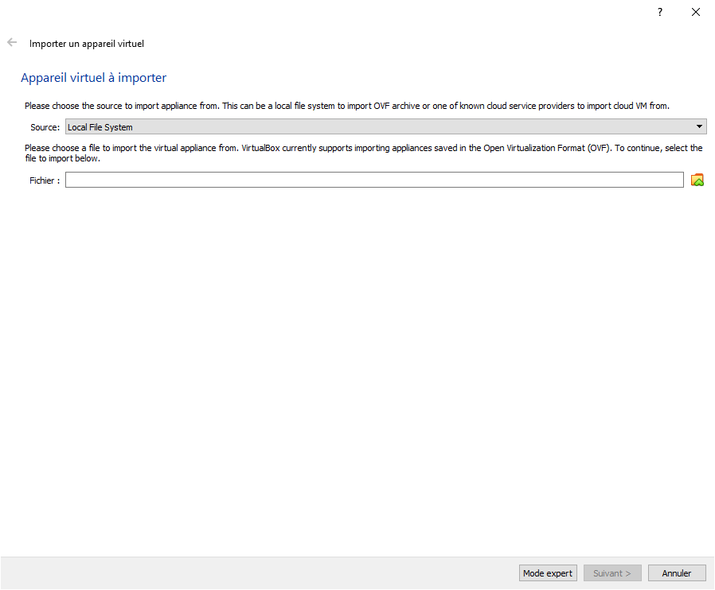

# How to setup and use pie-external VM

This method allow you to have the PIE's environment in a VM on your computer.

## First step

Install [Virtual Box](https://www.virtualbox.org/).

On linux you can install it with your packet manager (for [Debian](https://wiki.debian.org/VirtualBox) or [ArchLinux](https://wiki.archlinux.org/index.php/VirtualBox)).

## Second step

Download the VirtualBox appliance from [this address](https://static.cri.epita.fr/cri-vm.ova).

Open VirtualBox and go to `File > Import Appliance` and import the file you just downloaded.

When setting `Appliance settings` verify RAM parameters as minimum is `2048 MB`.

You can then click the `Import` button.

## Third step

Inside Virtual Box select your newly created virtual machine and click on `Start` button.

In the PXE menu, you should be used to see it, select `Prepare disk`.

Let it boot, a script will run automatically. Your VM will shutdown after script execution.

## Fourth step

You can now `Start` your VM again. You can now use the PXE menu as usual to boot `Archlinux` image.

Be careful ! You should log with `epita` user and no password. Your data is in `/home/epita`, this directory is persistent so you will not lose files when rebooting.
